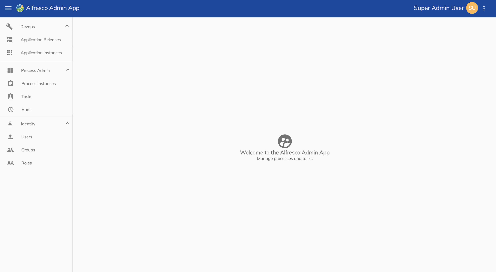

# Alfresco Administrator Application

The Alfresco Administrator Application is used to [deploy projects](deploy/index.md) that have been designed in the Alfresco Modeling Application and [manage users and permissions](identity/index.md) for Alfresco Content Automation Service.

> **Note**: It is important to note that once a project has been deployed it is referred to as an application. 

The Administrator Application has three distinct functions that are controlled by separate permissions. They are as follows:

* A **Devops** section for [deploying released projects](deploy/index.md) and [monitoring applications](deploy.md#monitoring-applications). It is also possible to define custom images when deploying an application for a number of services.

* A **Process Admin** section for [monitoring tasks](monitoring/index.md#monitoring-tasks), [monitoring processes](monitoring/index.md#monitoring-processes) and [audit functions](monitoring/index.md#audit).

* An **Identity** section for [managing users, groups and roles](identity/index.md).

The URL of the Administrator Application will be in the format: `gateway.{domain-name}/admin`. 

## About

The about page can be accessed via the UI or at the URL: `gateway.{domain-name}/admin/about` and shows the packages and package versions used in the application. 

## Settings

You can view the application configuration of the Administrator Application by visiting the URL: `gateway.{domain-name}/admin/app.config.json`. 
