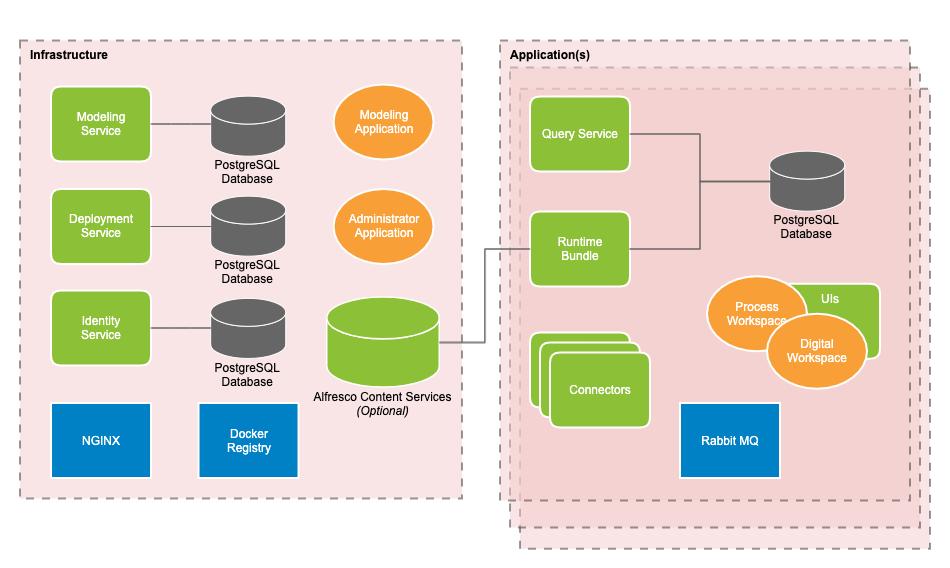

The following diagram describes the architecture of Alfresco Content Automation Service:

## Services

Alfresco ontent Automation Service is comprised of microservices and components. These services can be considered platform level services or application level services.

* [Platform services](platform.md) are those used across the whole platform to manage applications and support user interfaces.

* [Application services](application.md) are those deployed as part of an application to manage the running of process instances and tasks.

## User interfaces

There are [three user interfaces](ui.md) for Alfresco Content Automation Service that assist in managing different stages of process development, deployment and interaction.

## APIs 

There are a number of [REST APIs](../apis/index.md) exposed for different services by Alfresco Content Automation Service that can be used in addition to, or in place of, the user interfaces.
