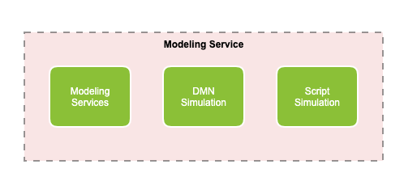

# Architecture

Process Automation provides a set of microservices and components that interact with Alfresco Cloud.

A high-level architectural diagram of Process Automation is:

## Modeling service

The modeling service is the backend service for the [Modeling Application](../model/README.md). It stores all project and model definitions into its own database that is then used by the [deployment service](#deployment-service) to deploy the projects. The database is deployed at the platform level and is independent of the databases used by applications.

The modeling service also contains a set of simulation services so that decision table and script functionality can be tested during the modeling experience.

## Deployment service

The deployment service is used to create deployment descriptors and deploy released projects.

The deployment service reads released project data from the modeling service database, but stores information related to deployment descriptors and deployments in its own database. This database is deployed at the platform level and is independent of the databases used by applications. The deployment service is the backend service for the [Admin Application](README.md).

Once a payload has been submitted to the deployment service through the API or using the Administrator Application a sequence of events happen:

* The first thing is validation to ensure the payload contains no errors and that there are no conflicts with any other application names already deployed into the cluster.

* Once validation has passed a series of data enrichment is applied to the payload specifying default values.

* After data enrichment is complete the payload is saved to the deployment service database as a descriptor.

* The final stage to deploy uses the Kubernetes API to deploy the images into their own namespace. This also includes a persistent volume that is mounted in the new namespace.

    **Note**: Each application is deployed into its own namespace.

## Identity Service

The [Identity Service](https://docs.alfresco.com/identity/concepts/identity-overview.html) is used for authentication throughout the Process Automation environment.

## Application runtime bundle

The application runtime bundle is a set of services that manage models at runtime. The service is deployed for each application and stores data in a database used solely for that application.

### Process runtime

The process runtime is an instance of the process engine that executes the process definitions. A synchronous REST API and an asynchronous message-based API are exposed by the process engine and [events](../model/processes/events.md) are emitted and consumed via Spring Cloud Streams.

### Form runtime

The form runtime contains the functionality required for [forms](../model/forms.md) at runtime.

### DMN runtime

The DMN runtime contains the functionality required for [decision tables](../model/decisions.md) at runtime.

### Script runtime

The script runtime contains the functionality required to execute [scripts](../model/scripts.md) at runtime.

### Preference

User preferences such as interface filters are retained in a key value store within the application database.

## Application query service

The application query service is a set of services used to query data stored by the [application runtime bundle](#application-runtime-bundle). The service is deployed for each application and reads the data stored in the application runtime database.

### Query

Tables for querying application data are separate to the runtime tables so that queries can be run without accessing any runtime services. Some data aggregation is performed on the tables to improve querying.

### Audit

Audit log tables for all application transactions are separate to the runtime tables so that they can be queried without accessing any runtime services. No data aggregation or manipulation is run against audit logs to enforce an accurate audit trail.

### Notification

The tables used for querying application data are also be used to set up [GraphQL](https://graphql.org/learn/) against in order to query specific events and use web sockets with.

## Process storage service

The process storage service is used for storing data in the Content Services repository. The service is deployed for each application.

## Connectors

Connectors are used to execute logic outside of the [application runtime bundle](#application-runtime-bundle). When the process flow reaches a connector, the values are sent from the process instance to a connector using the [message broker](#message-broker) to be used as part of the logic. The results are sent back to the process instance after the connector has finished and the process flow continues.

## Message broker

The message broker deployed with Process Automation routes the events emitted by the application runtime bundle to other services asynchronously.
